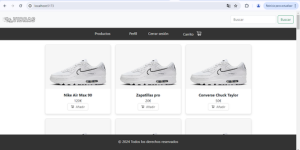

# E-commerce (Tienda Online)

Este proyecto es una tienda online creada con React. Implementa funcionalidades básicas de un e-commerce como registro, inicio de sesión, visualización de productos, carrito de compras y perfil de usuario. Utiliza React Router para la navegación y Context API para el manejo del estado global. Además, se ha estilizado con SASS para una mejor gestión de los estilos.

## Tabla de Contenidos
- [Características](#características)
- [Estructura del Proyecto](#estructura-del-proyecto)
- [Instalación](#instalación)
- [Uso](#uso)
- [Componentes](#componentes)
- [Context API](#context-api)
- [Estilos](#estilos)
- [Dependencias](#dependencias)
- [Contribuciones](#contribuciones)
- [Licencia](#licencia)

## Características
- Registro de usuarios
- Inicio de sesión
- Visualización de productos
- Carrito de compras
- Perfil de usuario con historial de pedidos
- Navegación con React Router
- Manejo del estado global con Context API
- Estilos gestionados con SASS

## Componentes

### Register
Formulario de registro de nuevos usuarios.

### Login
Formulario de inicio de sesión para usuarios registrados.

### Home
Página principal de la aplicación.

### Products
Componente que realiza una petición en `useEffect` para obtener los productos (`getProducts()`) y muestra una lista de productos.

### Product
Componente que mapea y muestra los productos individuales.

### Cart
Carrito de compras que permite a los usuarios ver y gestionar los productos que desean comprar.

### Profile
Vista del perfil del usuario con sus datos personales y sus pedidos.

### Header
Encabezado de la aplicación con navegación.

### Footer
Pie de página de la aplicación.

## Context API

### ProductContext
Maneja el estado global de los productos y el carrito de compras.

### UserContext
Maneja el estado global del usuario y sus pedidos.

## Estilos

El proyecto utiliza SASS para gestionar los estilos de manera modular. Se incluye un archivo `colors.scss` para definir colores y facilitar su reutilización en toda la aplicación.

## Dependencias

- React
- React Router
- Ant Design
- SASS

## Autora:
Patricia Arias Burdeos